# GastroHub Web

GastroHub is a modern B2B marketplace and management platform for the food supply chain, connecting buyers (restaurants, retailers) and suppliers (producers, distributors) with a seamless experience for product discovery, order management, messaging, and analytics.

---

## Project Overview

GastroHub enables buyers to discover suppliers, place and track orders, manage invoices, and communicate with suppliers, while suppliers can manage product listings, orders, and customer relationships. The platform supports hierarchical product categories, custom categories, and robust analytics for both buyers and suppliers.

---

## Main Features

- **Buyer Dashboard:** View recent orders, favorite suppliers, and key stats (orders, spending, deliveries)
- **Supplier Dashboard:** Manage listings, orders, and analytics
- **Product Listings:** Hierarchical categories, custom categories, and advanced search
- **Order Management:** Create, update, and track orders with real-time status
- **Messaging:** In-app messaging between buyers and suppliers
- **Invoices:** View and manage invoices, download PDFs
- **Analytics:** Track revenue, orders, and other KPIs
- **Authentication:** Secure login/signup and onboarding flows

## Technical Stack

- **Frontend:** React (TypeScript), React Query, Vite
- **UI:** Tailwind CSS, Lucide Icons, custom UI components
- **Backend:** Supabase (PostgreSQL, Auth, Storage, Realtime)
- **Data Fetching:** @tanstack/react-query + Supabase client
- **Deployment:** Vercel/Netlify (recommended), live Supabase instance (no local DB)

---

## Route Structure

```
/
|-- /about
|-- /analytics
|-- /blog
|-- /careers
|-- /contact
|-- /dashboard
|   |-- /dashboard/products
|   |   |-- /dashboard/products/new
|   |   |-- /dashboard/products/[productId]
|   |   |   |-- /dashboard/products/[productId]/edit
|   |-- /dashboard/CategoryManagementPage
|   |-- /dashboard/products.tsx
|-- /delivery
|-- /forgot-password
|-- /help-center
|-- /home
|-- /marketplace
|-- /messaging
|-- /privacy-policy
|-- /profile
|-- /security
|-- /suppliers
|-- /terms
|-- /auth
|   |-- /auth/login
|   |-- /auth/signup
|   |-- /auth/logout
|-- /buyer
|   |-- /buyer/dashboard
|-- /invoices
|   |-- /invoices/InvoiceDetailPage
|   |-- /invoices/InvoiceListPage
|-- /onboarding
|   |-- /onboarding/ProfileDetailsPage
|   |-- /onboarding/RoleSelectionPage
|-- /orders
|   |-- /orders/CreateOrderPage
|   |-- /orders/OrderProcessingPage
|   |-- /orders/OrderUpdatePage
|-- /supplier
|   |-- /supplier/DashboardPage
|   |-- /supplier/EditListingPage
|   |-- /supplier/ListingsPage
|   |-- /supplier/NewListingPage
|   |-- /supplier/OrderDetailPage
|   |-- /supplier/OrdersPage
|   |-- /supplier/SupplierMessages
```

---

## Database Structure (Key Tables)

- **profile:** User and company info (suppliers, buyers, delivery partners)
- **listing:** Product listings by suppliers
- **order:** Orders placed by buyers (with status, amount, items)
- **orderitem:** Line items for each order
- **favorite:** Tracks favorite suppliers (and possibly products) for each user
- **category / custom_category:** Hierarchical and user-defined product categories
- **invoice:** Invoices for completed orders

---

## Project Structure Diagram

```mermaid
graph TD;
  Root --> AboutPage
  Root --> AnalyticsPage
  Root --> BlogPage
  Root --> CareersPage
  Root --> ContactPage
  Root --> Dashboard
  Dashboard --> Products
  Products --> NewProduct
  Products --> ProductDetail
  ProductDetail --> EditProduct
  Dashboard --> CategoryManagement
  Root --> DeliveryPage
  Root --> ForgotPasswordPage
  Root --> HelpCenterPage
  Root --> HomePage
  Root --> MarketplacePage
  Root --> MessagingPage
  Root --> PrivacyPolicyPage
  Root --> ProfilePage
  Root --> SecurityPage
  Root --> SuppliersPage
  Root --> TermsPage
  Root --> Auth
  Auth --> LoginPage
  Auth --> SignUpPage
  Root --> Buyer
  Buyer --> BuyerDashboard
  Root --> Invoices
  Invoices --> InvoiceDetailPage
  Invoices --> InvoiceListPage
  Root --> Onboarding
  Onboarding --> ProfileDetailsPage
  Onboarding --> RoleSelectionPage
  Root --> Orders
  Orders --> CreateOrderPage
  Orders --> OrderProcessingPage
  Orders --> OrderUpdatePage
  Root --> Supplier
  Supplier --> SupplierDashboard
  Supplier --> EditListingPage
  Supplier --> ListingsPage
  Supplier --> NewListingPage
  Supplier --> OrderDetailPage
  Supplier --> OrdersPage
  Supplier --> SupplierMessages
```



---

## Authentication & Logging

- **Login and Logout Logging:**
  - The login and logout processes are now instrumented with detailed logging.
  - All login attempts, successes, and failures are logged to the browser console for easier debugging.
  - Logout actions (including Supabase sign-out and clearing of tokens) are logged step-by-step.
  - After a successful logout, users are redirected to the home page (`/`).
  - To view these logs, open your browser's developer tools (F12 or right-click → Inspect → Console tab) during authentication actions.

## Getting Started

1. **Install dependencies:**
   ```sh
   npm install
   ```
2. **Environment setup:**
   - Copy `.env.example` to `.env` and fill in your Supabase project keys (see project admin)
3. **Run the development server:**
   ```sh
   npm run dev
   ```
   (Uses Vite + nodemon for live reload)
4. **Production build:**
   ```sh
   npm run build && npm run preview
   ```

## Deployment
- Deploy the frontend to Vercel, Netlify, or similar
- Ensure your `.env` points to the live Supabase instance
- All DB migrations/changes must be made on the live Supabase project

## Contributing
- Please see `project_tree.md` and the route/diagram above for navigation
- All new features should use live data (no hardcoded lists)
- For questions or onboarding, contact the project maintainer

---

This documentation reflects the current route and high-level project structure as of 2025-06-18.
